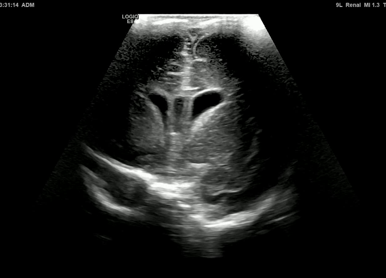
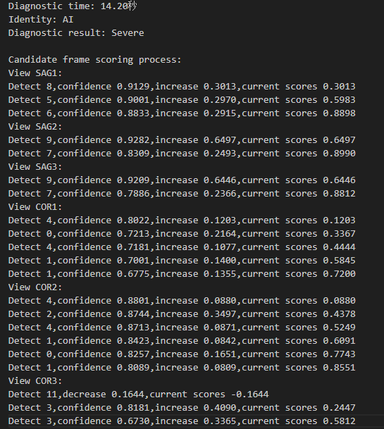

# Neonatal Cerebral Lesions Screening (NCLS)

[](https://github.com/Je1zzz/Neonatal_cerebral_lesions_screening_NCLS)


🚀 Neonatal Cerebral Lesions Screening (NCLS).

## Usage

### Installation

1. This project is implemented for **Python 3.10** and depends on [PyTorch](https://pytorch.org/get-started/previous-versions/) (torch 2.1.0). Follow the steps below for environment preparation.

```bash
1. git clone https://github.com/Je1zzz/Neonatal_cerebral_lesions_screening_NCLS.git
2. cd Neonatal_cerebral_lesions_screening_NCLS
3. conda create --name NCLS python=3.10
4. conda activate NCLS
5. pip install -r requirements.txt
```

2. Download example data and pretrained model

- **Pretrained weight**
  
  Download the model weights and save them to the `./log` folder.

- **Example data (videos)**
  
  Download the example data (video data) and save them to the `./Example_` folder.

- **Download link**
  
  [Demo data and model weight download LINK](https://drive.google.com/drive/folders/1aQDuLPmSBAULJ5soqeizaEkAHiwfpV1o?usp=sharing)


### Testing

To test the NCLS , run:

```bash
python module_diagnosis.py \
    --cfg_classfication configs/convnext.yaml \
    --weight_classfication log/diagnostic_weight.pth \
    --cfg_detection configs/rtdetrv2/rtdetrv2_r50vd_6x_coco.yml \
    --weight_detection log/detection_weight.pth \
    --dicom-dir Example_ \
    --output-dir output \
    --device cuda
```

Several steps will be taken next: 

1. Automatically extract standard views from CUS (cranial ultrasound) videos and save to the 'output/Standard View' folder.
2. Diagnose whether each newborn has severe brain injury based on the standard views. All results will save to 'output/Diagnostic result' folder. 

### Visualization
<p align="center" style="display: flex; justify-content: center; align-items: center;">
  
  
</p>
