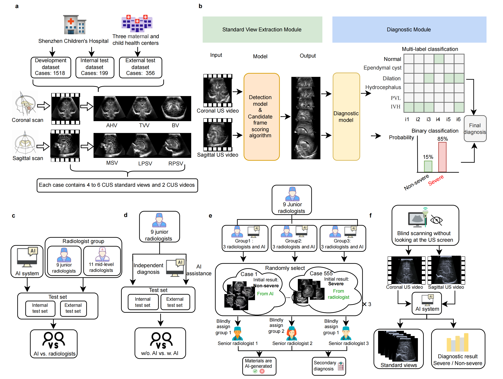
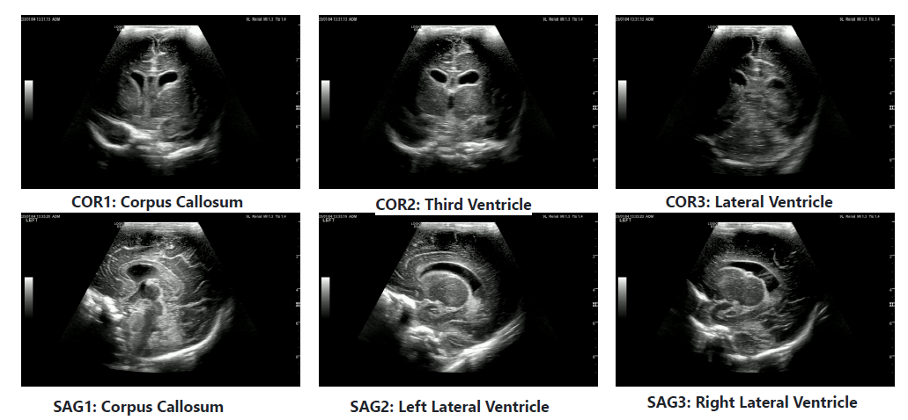
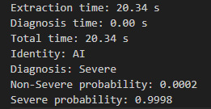

<h1 align="center">NCLS: Neonatal Cerebral Lesions Screening</h1>
<h3 align="center">Deep Learning-based Automated Screening System for Neonatal Brain Injury</h3>

<p align="center">
  <a href="https://www.nature.com/articles/s41467-025-63096-9"></a>
  <a href="https://github.com/Je1zzz/Neonatal_cerebral_lesions_screening_NCLS/stargazers"></a>
  
  
  
</p>

---

## 📰 News

**[2025-08-21]** Our paper **"Deep learning approach for screening neonatal cerebral lesions on ultrasound in China"** has been published in [*Nature Communications*](https://www.nature.com/articles/s41467-025-63096-9)! 🎉

---

## 📖 Overview

NCLS is an end-to-end deep learning system designed for automated screening of neonatal brain injuries using cranial ultrasound. The system achieves:

- ✨ **Automated Standard View Extraction**: Intelligently identifies and extracts standard views from cranial ultrasound videos
- 🔍 **AI-Powered Diagnosis**: Automatically determines the presence of severe brain injuries based on extracted views
- ⚡ **Clinical-Grade Performance**: Validated on large-scale clinical data with high accuracy and efficiency
- 🏥 **Production-Ready**: Optimized for real-world deployment in clinical settings

<details>
  <summary><b>📊 View System Architecture</b></summary>
  <p align="center">
    
  </p>
</details>

---

## 🚀 Getting Started

### Prerequisites

- Python 3.12
- PyTorch 2.2.0
- torchvision 1.17.0
- CUDA-compatible GPU (recommended)

### Installation

```bash
# Clone the repository
git clone https://github.com/Je1zzz/Neonatal_cerebral_lesions_screening_NCLS.git
cd Neonatal_cerebral_lesions_screening_NCLS

# Create conda environment
conda create --name NCLS python=3.12
conda activate NCLS

# Install dependencies
pip install -r requirements.txt
```

> **💡 Note**: For CUDA and PyTorch version compatibility, please refer to:
> - [CUDA and GPU Compatibility Guide](https://zhuanlan.zhihu.com/p/633473214)
> - [PyTorch Previous Versions](https://pytorch.org/get-started/previous-versions/)

### Download Pre-trained Models and Data

Download the following from [Google Drive](https://drive.google.com/drive/folders/1aQDuLPmSBAULJ5soqeizaEkAHiwfpV1o?usp=sharing):

- 📦 **Example Data**: Place in `./Example_/` directory
- 🎯 **Pre-trained Weights**: Place in `./log/` directory

**Expected Directory Structure:**
```
Neonatal_cerebral_lesions_screening_NCLS/
├── Example_/              # Sample ultrasound videos
│   └── [PatientID]/
│       └── [ExamDate]/
│           └── *.mp4
├── log/                   # Model checkpoints
│   ├── diagnostic_weight/
│   │   ├── fold_1.pth
│   │   ├── fold_2.pth
│   │   ├── fold_3.pth
│   │   ├── fold_4.pth
│   │   └── fold_5.pth
│   └── detection_weight.pth
├── output/                # Output results
├── configs/               # Configuration files
├── models/                # Model definitions
├── utils/                 # Utility functions
└── rt_detr/              # RT-DETR detection framework
```

---

## 🎯 Usage

### Complete Inference Pipeline

Run the full pipeline (view extraction + diagnosis):

```bash
python module_diagnosis.py \
    --cfg_classfication configs/convnext.yaml \
    --weight_classfication log/diagnostic_weight \
    --cfg_detection configs/rtdetrv2/rtdetrv2_r50vd_6x_coco.yml \
    --weight_detection log/detection_weight.pth \
    --dicom-dir Example_ \
    --output-dir output \
    --device cuda
```

### Standard View Extraction Only

Extract standard views without running diagnosis:

```bash
python module_extract_view.py \
    --cfg_detection configs/rtdetrv2/rtdetrv2_r50vd_6x_coco.yml \
    --weight_detection log/detection_weight.pth \
    --dicom-dir Example_ \
    --output-dir output \
    --device cuda
```

### Output Structure

The system generates the following outputs:

```
output/
├── StandardViews/         # Extracted standard views
│   └── [PatientID]/
│       └── [ExamDate]/
│           ├── COR1.png   # Coronal view 1
│           ├── COR2.png   # Coronal view 2
│           ├── COR3.png   # Coronal view 3
│           ├── SAG1.png   # Sagittal view 1
│           ├── SAG2.png   # Sagittal view 2
│           └── SAG3.png   # Sagittal view 3
└── DiagnosisResult/       # Diagnosis reports
    └── [PatientID]/
        └── [ExamDate]/
            └── diagnosis_result.txt
```

---

## 📊 Visualization

### Extracted Standard Views

<p align="center">
  
</p>

### Diagnosis Report

<p align="center">
  
</p>

---

## 🔬 Technical Details

### Models

- **Detection Model**: RT-DETR (Real-Time DEtection TRansformer) for anatomical structure detection
- **Classification Model**: ConvNeXt with multi-head attention for patient-level diagnosis

### Key Features

- **5-Fold Ensemble**: Utilizes 5-fold cross-validation models for robust predictions
- **Test-Time Augmentation (TTA)**: Applies 10× TTA to improve diagnostic accuracy
- **Multi-Level Classification**: 
  - Patient-level classification (Severe/Non-severe)
  - Image-level classification (lesion type detection)
  - View-level classification (standard view identification)

---

## 🙏 Acknowledgements

This project utilizes the [RT-DETR](https://github.com/lyuwenyu/RT-DETR) framework for real-time detection. We sincerely thank the authors for making their code publicly available. For simplicity, we have included only the inference-related code. For the complete codebase, please refer to the original repository.

---

## 📝 Citation

If you find our work useful in your research, please consider citing:

```bibtex
@article{lin2025deep,
  title   = {Deep learning approach for screening neonatal cerebral lesions on ultrasound in China},
  author  = {Lin, Zhouqin and Zhang, Haoming and Duan, Xingxing and Bai, Yan and Wang, Jian and 
             Liang, Qianhong and Zhou, Jingran and Xie, Fusui and Shentu, Zhen and Huang, Ruobing and 
             Chen, Yayan and Yu, Hongkui and Weng, Zongjie and Ni, Dong and Liu, Lei and Zhou, Luyao},
  journal = {Nature Communications},
  volume  = {16},
  number  = {1},
  pages   = {7778},
  year    = {2025},
  doi     = {10.1038/s41467-025-63096-9}
}
```

---

## 📧 Contact

For questions or collaboration opportunities, please contact the corresponding authors through the Nature Communications paper or reach out via [📧 haoming.zhang233@gmail.com](mailto:haoming.zhang233@gmail.com).

---

<p align="center">
  ❤️
</p>
