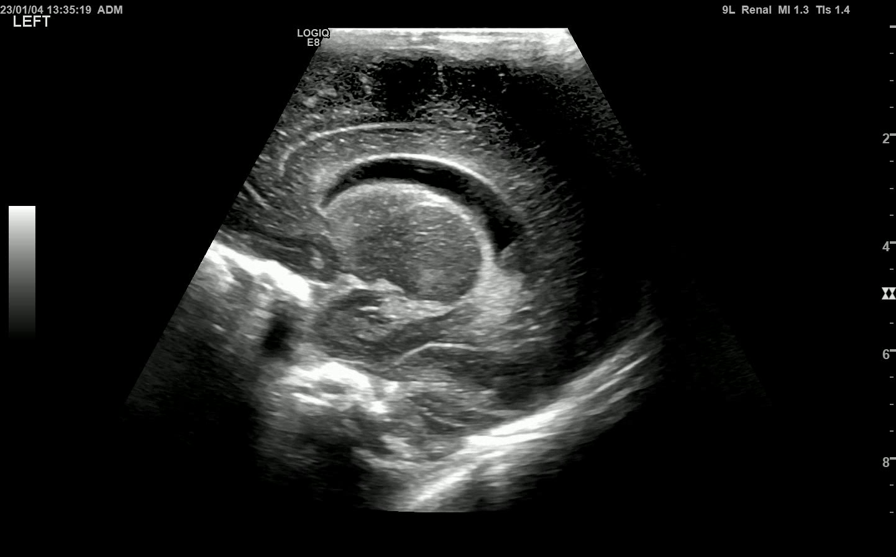
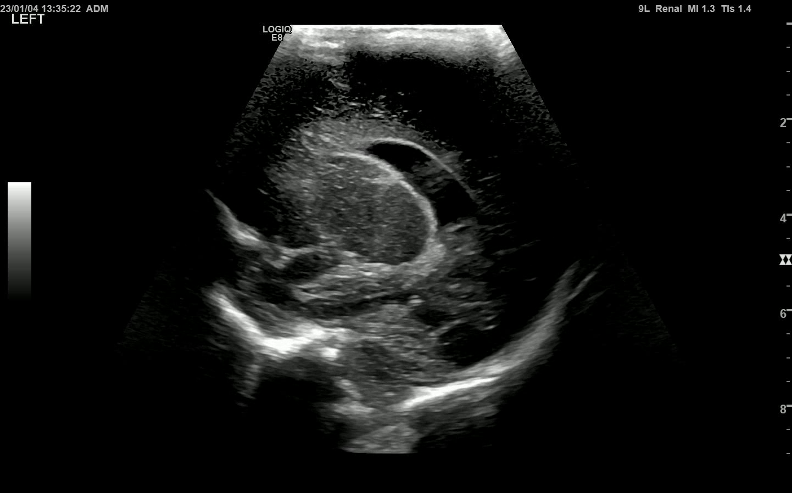

# Neonatal Cerebral Lesions Screening (NCLS)

🚀 Neonatal Cerebral Lesions Screening (NCLS) is an automated system for detecting and diagnosing cerebral lesions in neonatal cranial ultrasound images.

<details>
  <summary>Fig: Overall Architecture</summary>
  <p align="center">
    
  </p>
</details>

## Usage

### Installation

1. This project is implemented for **Python 3.10** and depends on [PyTorch](https://pytorch.org/get-started/previous-versions/) (torch 2.1.0). Follow the steps below for environment preparation.

   ```bash
   git clone https://github.com/Je1zzz/Neonatal_cerebral_lesions_screening_NCLS.git
   cd Neonatal_cerebral_lesions_screening_NCLS
   conda create --name NCLS python=3.10
   conda activate NCLS
   pip install -r requirements.txt
   ```

2. Download example data and pretrained model

- **Pretrained weight**

  Download the model weights and save them to the `./log` folder.

- **Example data (videos)**

  Download the example data (video data) and save them to the `./Example_` folder.

- **Download link**

  [Demo data and model weight download LINK](https://drive.google.com/drive/folders/1aQDuLPmSBAULJ5soqeizaEkAHiwfpV1o?usp=sharing)

### Testing

To test the NCLS , run:

```bash
python module_diagnosis.py \
    --cfg_classfication configs/convnext.yaml \
    --weight_classfication log/diagnostic_weight.pth \
    --cfg_detection configs/rtdetrv2/rtdetrv2_r50vd_6x_coco.yml \
    --weight_detection log/detection_weight.pth \
    --dicom-dir Example_ \
    --output-dir output \
    --device cuda
```

Several steps will be taken next:

1. Automatically extract standard views from CUS (cranial ultrasound) videos and save to the 'output/Standard View' folder.
2. Diagnose whether each newborn has severe brain injury based on the standard views. All results will save to 'output/Diagnostic result' folder.

### Visualization

#### Standard Views from a Single Case
<p align="center">
  <figure style="display: inline-block; width: 30%; margin: 5px;">
    
    <figcaption style="text-align: center;">COR1: Corpus Callosum</figcaption>
  </figure>
  <figure style="display: inline-block; width: 30%; margin: 5px;">
    
    <figcaption style="text-align: center;">COR2: Third Ventricle</figcaption>
  </figure>
  <figure style="display: inline-block; width: 30%; margin: 5px;">
    
    <figcaption style="text-align: center;">COR3: Lateral Ventricle</figcaption>
  </figure>
  <br>
  <figure style="display: inline-block; width: 30%; margin: 5px;">
    
    <figcaption style="text-align: center;">SAG1: Corpus Callosum</figcaption>
  </figure>
  <figure style="display: inline-block; width: 30%; margin: 5px;">
    
    <figcaption style="text-align: center;">SAG2: Lateral Ventricle</figcaption>
  </figure>
  <figure style="display: inline-block; width: 30%; margin: 5px;">
    
    <figcaption style="text-align: center;">SAG3: Cerebellum</figcaption>
  </figure>
</p>

#### Diagnostic Result


## Acknowledgements

This project uses the [RT-DETR](https://github.com/lyuwenyu/RT-DETR) framework for real-time detection. We thank the authors for making their code open source.
